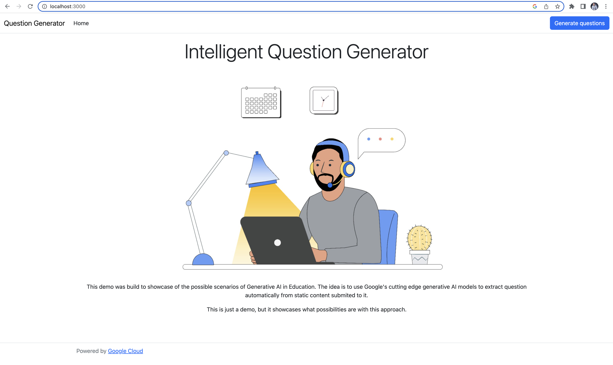

# Questions Generator

This is a simple demo that showcases how educational institutions could use Generative AI models in [Google Cloud (GCP)](https://cloud.google.com) to automatically generate questions from a given content. This is not designed to be a productive workload so please, be advised.

Contributions to the app are welcome!

## How to use it?

Questions Generator is a Node-based application. It doesn't save any information in any database. It is just a graphical UI to communicate back with a specific Google Cloud model in [Vertex AI](https://cloud.google.com/vertex-ai).

Do it to use it:

1. First thing, if you don't have it, install [Node.js](https://nodejs.org/en).
2. You will need [GCP SDK](https://cloud.google.com/sdk/docs/install) to get yourself authenticated and get the proper project set up in that context.
3. To authenticate yourself with GCP using `gcloud`, follow the instructions [here](https://cloud.google.com/sdk/gcloud/reference/auth/login).
4. Next step consists of defining the project that bears the Vertext model. For that, follow the instructions described [here](https://cloud.google.com/sdk/gcloud/reference/config/set).
5. Next, clone this repository to your machine.
6. Rename the file ".env.example" to only ".env".
7. Open the newly renamed ".env" file and update the variables as described below.
   1. `PROJECT_ID` with the numerical code of the GCP project that bears your Vertex model. You can get that information in the dashboard of your GCP console.
   2. `TOKEN` is the access code generated by your API integration in GCP. To generate that access code, just run the command below.

``gcloud auth application-default login``

8. Finally, from a terminal pointing to the root of the application, run the following command to start Node's local server. It will be served at port 3000, as you can see in the image above.

**Happy questions generation.**